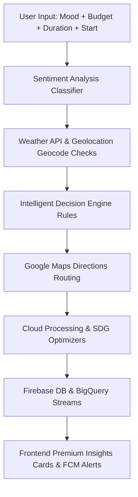

# AI-Powered Smart Travel Planner for Sustainable and Cost-Optimized Transportation

Welcome to the **AI-Powered Smart Travel Planner**. This full-stack web application enables carbon-footprint tracing, trip budgeting optimization, and travel-time comparisons. Designed to promote green transit choices, the application helps users select routes that align with cost constraints and environmental stewardship.

---

## 🌍 UN Sustainable Development Goals (SDG) Integration

This application directly implements and quantifies metrics supporting three primary United Nations SDGs:
1.  **SDG 11: Sustainable Cities and Communities**
    *   *Focus:* Encourages eco-friendly mass transit (buses/trains) and active mobility (walking/bicycling) over high-pollution private vehicles.
    *   *Implementation:* Highlighting public and zero-emission pathways as recommended default routes, helping decrease urban traffic congestion and particulate emissions.
2.  **SDG 12: Responsible Consumption and Production**
    *   *Focus:* Maximizing resource distribution efficiency and individual financial budget planning.
    *   *Implementation:* Features a robust budget-capping optimizer that flags routes exceeding budget thresholds and highlights the most economically sound choices.
3.  **SDG 13: Climate Action**
    *   *Focus:* Climate-change mitigation through greenhouse gas tracking.
    *   *Implementation:* Computes and displays the carbon footprint ($CO_2$ emissions in kilograms) for each transit option using standardized distance-to-emission factors.

---

## 🛠️ Tech Stack & Architecture

*   **Frontend:** React (Vite, Tailwind CSS, Lucide Icons)
*   **Backend:** Python Flask API
*   **Database:** Cloud Firestore (Firebase) with local JSON emulated database fallback
*   **Cloud Hosting & Services:** Google Cloud Platform (Cloud Storage, BigQuery, Maps API, Cloud Functions)

```
React Frontend (Vite) 
      ↓  (POST /get-routes)
Python Flask Backend 
      ├─→ Google Maps API (Directions queries)
      ├─→ Cloud Function (Optimization & Carbon footprint processing)
      ├─→ Google Cloud Storage (Search log backups)
      ├─→ Cloud Firestore (Saved searches & user database)
      └─→ Google BigQuery (Search & Preference analytical streams)
```


---

## 🧠 System Architecture & Model Working Flow

This section outlines the step-by-step processing pipeline and decision-making logic powering the **AI Vibe Travel Planner**:

### 🏗️ Data Flow & Architecture Diagram



---

### 🔄 Step-by-Step Model Execution Pipeline

#### 🥇 Step 1: User Input Collection
The React frontend collects traveler constraints:
*   **Vibe/Mood description:** (Text entered by the user or clicked from quick tag presets like `🧘 Calm & Relaxed`, `🌋 Stressed Out`, `🧗 Adventurous`).
*   **Budget threshold:** (Input limits or slider values).
*   **Duration days:** (Slider values between 1-14 days).
*   **Source location:** (Autocompleted or fetched using live coordinates).

#### 🥈 Step 2: Location Geocode Detection
Using browser geolocation:
*   `navigator.geolocation.getCurrentPosition()` retrieves active coordinates (`latitude, longitude`).
*   The system parses coordinates (e.g. `9.0994, 76.4903` Kochi area) to set the start location geocodes.

#### 🥉 Step 3: Natural Language Sentiment Analysis
*   **Backend Classifier:** Analyzes user vibe text via keyword-nlp mapping or Google Gemini Vertex AI models.
*   **Vibe Categories:** Categorizes user emotion into `Stressed`, `Adventurous`, `Relaxed`, `Romantic`, or `Neutral`.

#### 🏅 Step 4: Weather Safety Analysis
*   Queries active climate conditions using the geocodes.
*   **Adverse Weather Warning:** Automatically checks for rain, fog, storms, or snow. If hazardous weather is found near the destination, the system triggers active alerts and prompts the user to route via public rail for zero-risk transit.

#### 🎖️ Step 5: Core Decision Recommendation Engine
The core rules engine evaluates mood, budget, duration, and weather variables:
*   **Mood Matching:** `Stressed/Relaxed` triggers soothing coastal beaches or hill stations (e.g. Munnar, Wayanad); `Adventurous` recommends trekking/wilderness terrains (e.g. Manali).
*   **Weather Safe Overrides:** If storm/rain is detected at the ideal destination, the system reroutes to alternative locations with mild climate conditions (e.g. Ooty).
*   **Budget Limits:** Low budget triggers closer local getaways to minimize travel costs, while high budget yields popular further locations.
*   **Duration:** Pairs short trips (1-2 days) with high-speed direct travel, and longer trips with immersive daily schedules.

#### 🧭 Step 6: Route Optimizations & Directions
*   Leverages the **Google Directions API** to compile actual travel coordinates, distance vectors, and transit time lists.

#### 💰 Step 7: Sustainable Cost & Carbon calculations
*   **Costing:** Computes fuel consumption charges, public transit tickets, and green lodging fees based on durations.
*   **Carbon Footprint:** Analyzes $CO_2$ impact in kilograms ($CO_2 = distance \times emission\_factor$) to output clean SDG-rated badges.

#### ☁️ Step 8: GCP Cloud Processing Pipeline
*   **Cloud Functions:** Dispatches and runs optimization algorithms.
*   **BigQuery & Firebase:** Logs user travel preferences, cost profiles, and sentiments into central analytics streams.
*   **FCM Notifications:** Pushes warning popups if carbon footprints exceed 15kg or adverse weather poses road congestion.

#### 🧾 Step 9: Final Premium Insights Render
Outputs the unified visual travel dashboard:
*   *Live weather indicators.*
*   *Interactive route direction map pins.*
*   *Why this trip? description explanation.*
*   *Categorized budget cost estimate breakdown table.*
*   *Dynamic day-by-day itinerary timelines.*

---

## 🎓 Viva & Presentation Quick Guide (For Reference)

When presenting this project in evaluations or viva examinations, explain the workflow as follows:

> **"The system operates as a unified, data-driven pipeline. It collects user mood, budget, and trip duration from the frontend. The backend classifies the emotional sentiment using simple NLP keyword rules and Google Gemini models. Simultaneously, geolocated coordinates are mapped against climate APIs to check for weather safety.**
> 
> **These variables pass into our core Decision Rules Engine, which matches moods to destinations and performs protective rerouting if adverse weather is detected. It then queries the Maps Platform for real routes, computes cost/carbon metrics aligning with UN SDGs 11, 12, and 13, streams logs to BigQuery for analytical dashboards, and renders a fully customized, day-by-day travel plan."**

---

## 🚀 Quick Start: Running Locally

Both the frontend and backend are equipped with **Mock Database & API Fallbacks**, meaning the application will run perfectly out-of-the-box locally, even without active Google Cloud or Firebase billing credentials configured!

### Prerequisites
*   Node.js (v18+)
*   Python (3.9+)

---

### Step 1: Run the Backend (Flask API)
1.  Open your terminal and navigate to the `backend` folder:
    ```bash
    cd backend
    ```
2.  Install Python dependencies:
    ```bash
    pip install -r requirements.txt
    ```
3.  *(Optional)* Create a `.env` file in the `backend` folder and add your Google Cloud credentials:
    ```env
    PORT=5000
    GOOGLE_MAPS_API_KEY=your_google_maps_key
    FIREBASE_CREDENTIALS_PATH=path/to/firebase-sdk.json
    GCS_LOG_BUCKET_NAME=your_gcs_log_bucket
    BIGQUERY_TABLE_ID=your_project.your_dataset.your_table
    ```
    *If no keys are supplied, the backend automatically runs in mock-emulation mode with highly realistic calculations.*
4.  Launch the API:
    ```bash
    python app.py
    ```
    *The API will start running on `http://localhost:5000`.*

---

### Step 2: Run the Frontend (React)
1.  Open a new terminal tab and navigate to the `frontend` folder:
    ```bash
    cd frontend
    ```
2.  Install packages:
    ```bash
    npm install
    ```
3.  Launch the Vite development server:
    ```bash
    npm run dev
    ```
4.  Open your browser and visit: **`http://localhost:3000`**

---

## 📡 API Documentation

### 1. Route Optimization & Retrieval
*   **Endpoint:** `/get-routes`
*   **Method:** `POST`
*   **Request Headers:** `Content-Type: application/json`
*   **Request JSON Schema:**
    ```json
    {
      "source": "Mumbai, MH",
      "destination": "Pune, MH",
      "budget": 50,
      "preference": "eco-friendly"
    }
    ```
*   **Response JSON Schema:**
    ```json
    {
      "routes": [
        {
          "id": "route_1",
          "mode": "driving",
          "mode_display": "Driving (Car)",
          "distance": "148.5 km",
          "distance_val": 148500,
          "time": "2h 15m",
          "time_val": 8100,
          "cost": 37.12,
          "carbon": 17.82,
          "tags": ["Fastest"]
        },
        {
          "id": "route_2",
          "mode": "transit",
          "mode_display": "Public Transit (Bus/Train)",
          "distance": "153.2 km",
          "distance_val": 153200,
          "time": "3h 5m",
          "time_val": 11100,
          "cost": 12.26,
          "carbon": 6.13,
          "tags": ["Cheapest", "Eco-Friendly"]
        }
      ],
      "recommendation": "route_2",
      "budget_exceeded": false,
      "sdg_alignments": {
        "sdg_11_message": "...",
        "sdg_12_message": "...",
        "sdg_13_message": "..."
      }
    }
    ```

### 2. Save Route Selection
*   **Endpoint:** `/save-route`
*   **Method:** `POST`
*   **Request JSON Schema:**
    ```json
    {
      "source": "Mumbai, MH",
      "destination": "Pune, MH",
      "budget": 50,
      "preference": "eco-friendly",
      "selected_route": { "id": "route_2", "mode": "transit", "cost": 12.26, "carbon": 6.13 },
      "routes": [...]
    }
    ```
*   **Response:**
    ```json
    { "message": "Successfully saved route to database & analytics logged." }
    ```

---

## ☁️ Google Cloud Platform Setup & Deployment

When you are ready to migrate from local emulation to Google Cloud, follow these steps:

### 1. Google Maps Platform
1.  Go to the [Google Cloud Console](https://console.cloud.google.com/).
2.  Enable the **Directions API** and **Places API** from the API Library.
3.  Go to **APIs & Services > Credentials** and generate an API key. 
4.  Add the key to `GOOGLE_MAPS_API_KEY` in the backend `.env`.

### 2. Firebase & Cloud Firestore
1.  Go to the [Firebase Console](https://console.firebase.google.com/) and create a project.
2.  Enable **Cloud Firestore** in test mode.
3.  Go to **Project Settings > Service Accounts** and generate a new Private Key (downloaded as a `.json` file).
4.  Save the path to this JSON file as `FIREBASE_CREDENTIALS_PATH` in the backend `.env`.

### 3. Google Cloud Storage (GCS)
1.  Go to GCS in the Cloud Console.
2.  Click **"Create Bucket"**, configure settings, and name your bucket (e.g. `smart-travel-logs`).
3.  Save the bucket name as `GCS_LOG_BUCKET_NAME` in the backend `.env`.

### 4. Cloud Functions
1.  Go to the **Cloud Functions** page in the Cloud Console.
2.  Click **Create Function**, select **Python 3.9+** runtime, and specify the entrypoint function as `handler`.
3.  Paste the contents of `backend/cloud_function.py` into `main.py` and deploy it.

### 5. BigQuery
1.  Go to BigQuery in the Cloud Console.
2.  Create a **Dataset** named `travel_planner`.
3.  Create a **Table** named `searches_analytics` with the following schema fields:
    *   `timestamp` (STRING)
    *   `source` (STRING)
    *   `destination` (STRING)
    *   `budget` (FLOAT)
    *   `preference` (STRING)
    *   `selected_mode` (STRING)
    *   `saved_cost` (FLOAT)
    *   `saved_carbon` (FLOAT)
4.  Provide your table name as `BIGQUERY_TABLE_ID` (e.g. `your-project-id.travel_planner.searches_analytics`) in the `.env`.

### 6. Cloud Hosting & Deployment
*   **Backend (Render / Cloud Run):**
    *   Deploy `backend/` to [Render](https://render.com/) or Google Cloud Run as a Web Service.
    *   Select **Python** as the environment and specify `python app.py` (or `gunicorn app:app`) as the start command.
*   **Frontend (Vercel / Netlify):**
    *   Deploy `frontend/` to Vercel or Netlify.
    *   Configure Vercel build settings:
        *   **Build Command:** `npm run build`
        *   **Output Directory:** `dist`
# Travel-Planner

